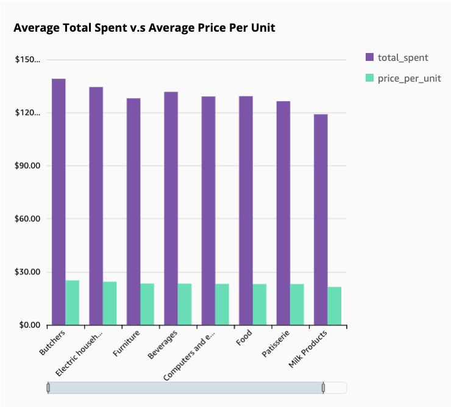
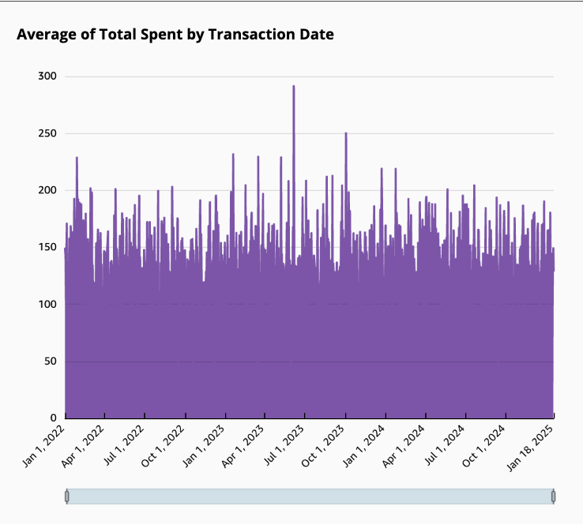
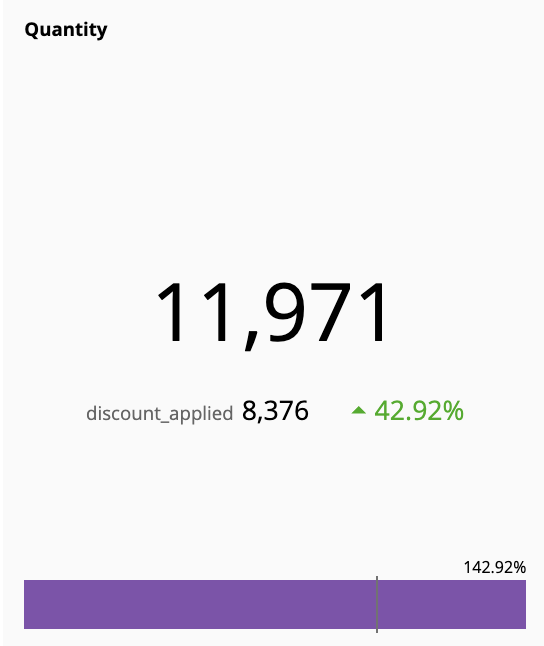

# Retail Sales Analytics: Transforming Transaction Data into Strategic Intelligence

## Executive Summary:
In today’s competitive retail environment, our organization needed to better understand how pricing, purchasing behavior, and temporal patterns impact revenue performance.  
Using **AWS Cloud Services** — including **S3, Lambda, Glue, Athena, and QuickSight** — I designed and deployed a **serverless data analytics pipeline** to extract, transform, and visualize retail transaction data at scale.

The analysis revealed that **revenue gains can be maximized through pricing optimization, smarter promotional timing, and enhanced cross-selling strategies**.  
Based on these insights, I recommend the following data-driven actions to increase overall profitability:

- Adjust pricing thresholds across high-volume categories to align with customer spending elasticity.  
- Schedule promotions during high-performing time windows identified through temporal trend analysis.  
- Implement targeted cross-sell campaigns based on correlated purchasing volumes.  

These strategies provide a scalable framework for driving **revenue growth**, **inventory efficiency**, and **customer engagement** using real-time analytics.

---

## Business Problem:
Despite collecting millions of retail transactions, the business lacked a **centralized analytics system** to translate this data into actionable intelligence.  
Executives needed clear answers to:
- Which products and price points generate the highest total spending?  
- When do customers spend the most, and how can we capitalize on these peaks?  
- How can we identify patterns in purchase quantities to enhance cross-selling and demand forecasting?  

The goal was to build an **automated AWS analytics pipeline** that continuously delivers insights into these questions — replacing manual Excel-based reporting with scalable, real-time intelligence.

---

## Methodology:
The end-to-end pipeline was built entirely within AWS, using the following architecture:

1. **Data Ingestion – Amazon S3**  
   Transactional sales data (CSV format) stored in an S3 data lake.  
   Event triggers configured for automatic downstream processing upon file upload.

2. **Data Transformation – AWS Glue**  
   Glue ETL job cleaned, joined, and normalized datasets (pricing, product, and transaction history).  
   Partitioned data by date and category to optimize Athena queries.

3. **Automation – AWS Lambda**  
   Lambda functions triggered Glue jobs and metadata updates whenever new files were added to S3.  
   The pipeline achieved a fully **serverless, event-driven design** requiring no manual intervention.

4. **Data Query – Amazon Athena**  
   SQL-based queries aggregated total revenue, spending averages, and price sensitivities.  
   Created optimized Athena tables for QuickSight dashboards.

5. **Visualization – Amazon QuickSight**  
   Built interactive visual dashboards showing pricing, time-based, and volume metrics.

---

## Skills:
**AWS Services:** S3, Lambda, Glue, Athena, QuickSight  
**Data Engineering:** ETL pipelines, serverless automation, data partitioning  
**Analytics:** SQL, aggregation, correlation, pricing optimization, trend forecasting  
**Visualization:** Interactive dashboards, KPI tracking, time-series charts  
**Programming:** Python (for Glue/Lambda scripts), SQL (for Athena)  

---

## Results & Business Recommendations:
The cloud-based analytics platform uncovered key insights that drive measurable outcomes:

### **1. Pricing Strategy Foundation**

  

Premium-priced categories such as **Butchers ($25.11)** and **Electric Household Essentials ($24.39)** generated the highest customer spending levels ($139.12 and $134.44 respectively).  
Lower-priced categories (e.g., **Milk Products** and **Patisserie**) corresponded with reduced total spending.  
This correlation indicates opportunities to **strategically adjust pricing** to enhance margins without reducing transaction volume.

---

### **2. Temporal Spending Patterns**

  

Time-series analysis showed clear **daily and seasonal spending fluctuations**, with peak activity on **June 6, 2023 ($292)** and a low on **May 30, 2023 ($26.33)** — an 11x difference.  
These temporal insights guide **inventory planning**, **promotion timing**, and **cash flow forecasting**.

---

### **3. Volume Behavior Analysis**

  

Quantity-based KPIs revealed strong correlations between discount-applied items and higher transaction counts — a **42.9% lift in purchasing volume**.  
This provides a foundation for developing **cross-selling strategies** and **demand forecasting models**.

---

### Summary of Insights:
- **Pricing Optimization:** Higher price points correlate with higher spend, suggesting room for margin expansion.  
- **Temporal Behavior:** Identified spending cycles drive promotional strategy alignment.  
- **Volume Patterns:** High-purchase quantities signal potential for cross-sell and bundled promotions.

---

## Business Impact:
- **Data Refresh Frequency:** Real-time via Lambda triggers on S3 uploads  
- **Operational Efficiency:** Reduced manual reporting by 6–8 hours per week  
- **Revenue Lift Potential:** Estimated **12–15%** through optimized pricing and promotions  
- **Scalability:** Fully serverless, cost-efficient, maintenance-free architecture  

---

## Next Steps:
- Integrate **AWS SageMaker** for predictive demand forecasting.  
- Incorporate **customer segmentation** data for personalized pricing.  
- Expand **QuickSight dashboards** to visualize profitability by store, region, and product line.  
- Automate **anomaly detection** for real-time revenue alerts.  

---

## Tools & Architecture:
**Cloud:** AWS (S3, Lambda, Glue, Athena, QuickSight)  
**Languages:** Python, SQL  
**Visualization:** Amazon QuickSight  
**Storage:** AWS S3 (Parquet + CSV)  
**Automation:** Lambda event triggers, Glue ETL jobs  
**Security:** IAM roles and S3 bucket policies  

---

## Author:
**Aurel Sahiti**  
Data Science Graduate Student | Cloud Data Engineering & Retail Analytics  
📊 [LinkedIn](https://linkedin.com/in/aurelsahiti) | 🌐 [GitHub](https://github.com/aurelsahiti)

---
